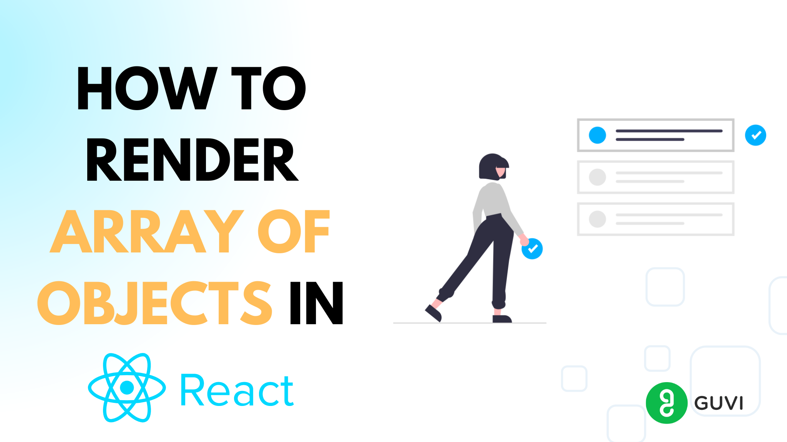
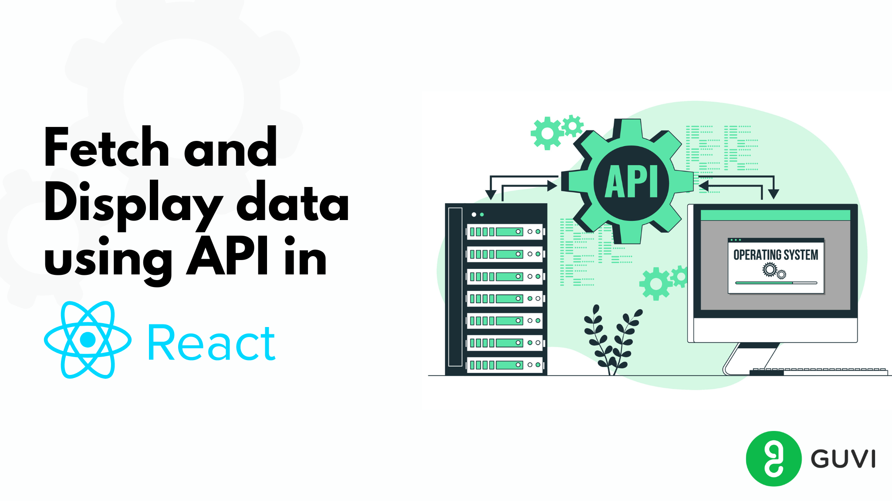
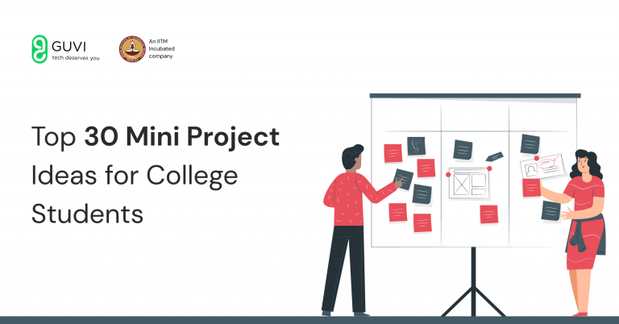
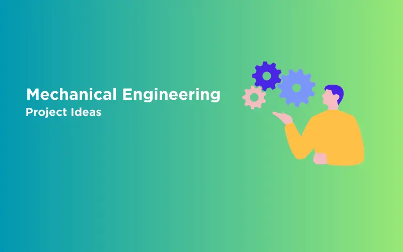

  

        
        <h6 className="card-subtitle p-2">How to Render an Array of Objects in React? [in 3 easy steps]</h6>
        

          
By Tarun Singh

21 Mar, 2024 7 Min Read
 
        

      

      

        
        <h6 className="card-subtitle p-2">Use ReactJS to Fetch and Display Data from API – 5 Simple Steps</h6>
        

          
By Tarun Singh

21 Mar, 2024 5 Min Read
 
        

      

      

        
        <h6 className="card-subtitle p-2">Top 10 Unique Project Ideas for College Students</h6>
        

          
By Lukesh S

21 Mar, 2024 5 Min Read
 
        

      

      

      

      

        
        <h6 className="card-subtitle p-2">Top 30 Mini Project Ideas For College Students [UPDATED]</h6>
        

          
By Srinithi Shankar

25 Mar, 2024 6 Min Read
 
        

      

      

        
        <h6 className="card-subtitle p-2">20 Mechanical Engineering Project Ideas</h6>
        

          
By Meghana D

25 Mar, 2024 9 Min Read
 
        

      

      

        
        <h6 className="card-subtitle p-2">30 Best JavaScript Project Ideas For You [3 Bonus Portfolio Projects]</h6>
        

          
By Meghana D

25 Mar, 2024 9 Min Read
 
        

